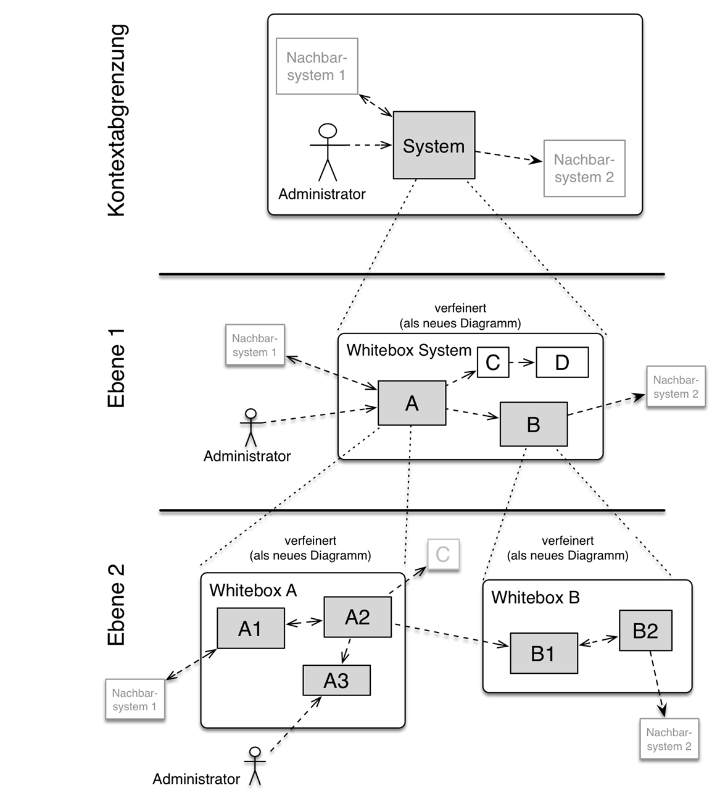
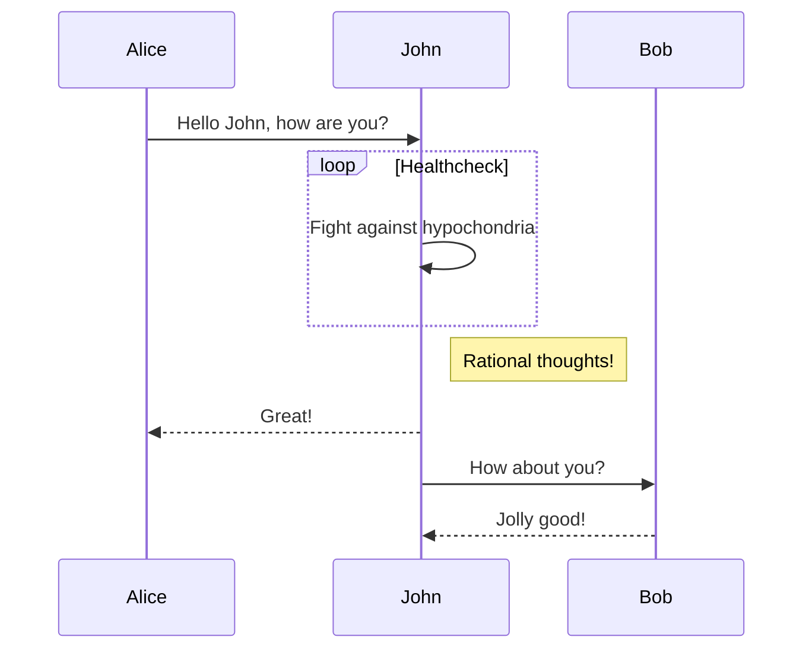
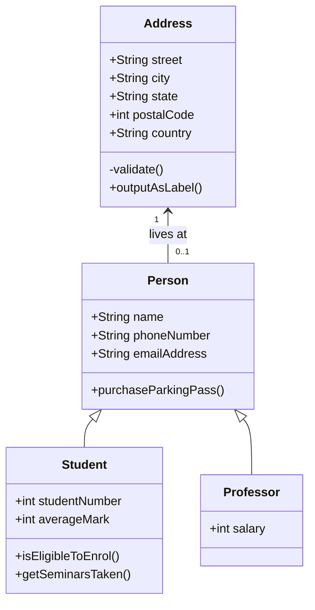

# Carrent

For full documentation visit [mkdocs/reference](https://squidfunk.github.io/mkdocs-material/reference/).

## Einführung und Ziele
Beschreibt die wesentliche Anforderungen und treibenden Kräfte, die Softwarearchitekten und Entwicklungsteams berücksichtigen müssen. Dazu gehören die

  * zugrunde liegenden Geschäftsziele, wesentliche Aufgabenstellung und essenzielle fachliche Anforderungen an das System
  * Qualitätsziele für die Architektur
  * relevante Stakeholder und deren Erwartungshaltung

## Aufgabenstellung
### Inhalt
Kurzbeschreibung der fachlichen Aufgabenstellung, treibenden Kräfte, Extrakt (oder Abstract) der Anforderungen. Verweis auf (hoffentlich vorliegende) Anforderungsdokumente (mit Versionsbezeichnungen und Ablageorten).

### Motivation
Aus Sicht der späteren Nutzer ist die Unterstützung einer fachlichen Aufgabe oder Verbesserung der Qualität der eigentliche Beweggrund, ein neues System zu schaffen oder ein bestehendes zu modifizieren.

### Form
Kurze textuelle Beschreibung, eventuell in tabellarischer Use-Case Form. Sofern vorhanden sollte die Aufgabenstellung Verweise auf die entsprechenden Anforderungsdokumente enthalten.
Halten Sie diese Auszüge so knapp wie möglich und wägen Sie Lesbarkeit und Redundanzfreiheit gegeneinander ab.

## Qualitätsziele
### Inhalt
Die Top-3 bis Top-5 der Qualitätsziele für die Architektur, deren Erfüllung oder Einhaltung den maßgeblichen Stakeholdern besonders wichtig sind. Gemeint sind hier wirklich Qualitätsziele, die nicht unbedingt mit den Zielen des Projekts übereinstimmen. Beachten Sie den Unterschied.

### Motivation
Weil Qualitätsziele grundlegende Architekturentscheidungen oft maßgeblich beeinflussen, sollten Sie die für Ihre Stakeholder relevanten Qualitätsziele kennen, möglichst konkret und operationalisierbar.
Wenn Sie als Architekt nicht wissen, woran Ihre Arbeit gemessen wird, ….

### Form
Tabellarische Darstellung der Qualitätsziele mit möglichst konkreten Szenarien, geordnet nach Prioritäten.

## Stakeholder
### Inhalt
Expliziter Überblick über die Stakeholder des Systems, d.h. über alle Personen, Rollen oder Organisationen, die

  * die Architektur kennen sollten oder
  * von der Architektur überzeugt werden müssen,
  * mit Architektur oder Code arbeiten (z.B. Schnittstellen nutzen),
  * Dokumentation der Architektur für ihre eigene Arbeit benötigen,
  * Entscheidungen über das System und dessen Entwicklung treffen.

### Motivation
Sie sollten die Projektbeteiligten und -betroffenen kennen, sonst erleben Sie später im Entwicklungsprozess Überraschungen. Diese Stakeholder bestimmen unter anderem Umfang und Detaillierungsgrad der von Ihnen zu leistenden Arbeit und Ergebnisse.

### Form
Tabelle mit Rollen- oder Personennamen, sowie deren Erwartungshaltung bezüglich der Architektur und deren Dokumentation.

| Rolle | Kontakt | Erwartungshaltung |
| ----  | ------- | ----------------- |
| Rolle-1  | Kontakt-1 | Erwartung-1 |
| Rolle-2  | Kontakt-2 | Erwartung-2 |

## Randbedingungen
### Inhalt
Fesseln und Vorgaben, die ihre Freiheiten bezüglich Entwurf, Implementierung oder Ihres Entwicklungsprozesses einschränken. Diese Randbedingungen gelten manchmal organisations- oder firmenweit über die Grenzen einzelner Systeme hinweg.

### Motivation
Als Architekt sollten Sie explizit wissen, wo Ihre Freiheitsgrade bezüglich Entwurfsentscheidungen liegen und wo Sie Randbedingungen beachten müssen. Sie können Randbedingungen vielleicht noch verhandeln, zunächst sind sie aber da.

### Form
Einfache Tabellen der Randbedingungen mit Erläuterungen. Bei Bedarf unterscheiden Sie technische, organisatorische und politische Randbedingungen oder übergreifende Konventionen (beispielsweise Programmier- oder Versionierungsrichtlinien, Dokumentation- oder Namenskonvention)

## Kontextabgrenzung
### Inhalt
Die Kontextabgrenzung grenzt das System von allen Kommunikationspartnern (Nachbarsystemen und Benutzerrollen) ab. Sie legt damit die externen Schnittstellen fest.
Differenzieren Sie fachlichen Kontext (fachliche Ein- und Ausgaben) und technischen Kontext (Kanäle, Protokolle, Hardware), falls nötig.

### Motivation
Die fachlichen und technischen Schnittstellen zu Kommunikationspartnern gehören zu den kritischsten Aspekten eines Systems. Stellen Sie sicher, dass Sie diese komplett verstanden haben.

### Form
Verschiedene Optionen:

  * Diverse Kontextdiagramme
  * Listen von Kommunikationspartnern mit deren Schnittstellen

## Fachlicher Kontext
### Inhalt
Festlegung aller Kommunikationspartner (Nutzer, IT-Systeme, …) mit Erklärung der fachlichen Ein- und Ausgabedaten oder Schnittstellen. Zusätzlich bei Bedarf fachliche Datenformate oder Protokolle der Kommunikation mit den Nachbarsystemen.

### Motivation
Alle Beteiligten müssen verstehen, welche fachlichen Informationen mit der Umwelt ausgetauscht werden.

### Form
Alle Diagrammarten, die das System als Black Box darstellen und die fachlichen Schnittstellen zu den Nachbarn beschreiben.
Alternativ oder ergänzend können Sie eine Tabelle verwenden. Der Titel gibt den Namen Ihres Systems wieder; die drei Spalten sind: Kommunikationspartner, Eingabe, Ausgabe.

## Technischer Kontext
### Inhalt
Technische Schnittstellen (Kanäle, Übertragungsmedien) zwischen dem System und seiner Umwelt. Zusätzlich eine Erklärung (mapping), welche fachlichen Ein- und Ausgaben über welche technischen Kanäle fließen.

### Motivation
Viele Stakeholder treffen Architekturentscheidungen auf Basis der technischen Schnittstellen des Systems zu seinem Kontext.
Insbesondere Infrastruktur- oder Hardwareentwickler entscheiden auch über diese technischen Schnittstellen.

### Form
Beispielsweise UML Deployment-Diagramme mit den Kanälen zu Nachbarsystemen, begleitet von einer Tabelle, die Kanäle auf Ein-/Ausgaben abbildet.

## Lösungsstrategie
### Inhalt
Kurzer Überblick über die grundlegenden Entscheidungen und Lösungsansätze, die Entwurf und Implementierung des Systems prägen. Hierzu gehören:

  * Technologieentscheidungen
  * Entscheidungen über die Top-Level-Zerlegung des Systems, beispielsweise die Verwendung gesamthaft prägender Entwurfs- oder Architekturmuster
  * Entscheidungen zur Erreichung der wichtigsten Qualitätsanforderungen
  * relevante organisatorische Entscheidungen, beispielsweise für bestimmte Entwicklungsprozesse oder Delegation bestimmter Aufgaben an andere Stakeholder.

### Motivation
Diese allerwichtigsten Entscheidungen bilden wesentliche „Eckpfeiler“ der Architektur. Von ihnen hängen meistens viele weitere Entscheidungen oder Implementierungsregeln ab.

### Form
Fassen Sie die zentralen Entwurfsentscheidungen kurz zusammen. Motivieren Sie ausgehend von Aufgabenstellung, Qualitätszielen und Randbedingungen, was Sie entschieden haben und warum Sie so entschieden haben. Verweisen Sie eher auf weitere Ausführungen in Folgeabschnitten.

## Bausteinsicht
### Inhalt
Diese Sicht zeigt die statische Zerlegung des Systems in Bausteine (Module, Komponenten, Subsysteme, Klassen, Interfaces, Pakete, Bibliotheken, Frameworks, Schichten, Partitionen, Tiers, Funktionen, Makros, Operationen, Datenstrukturen…) sowie deren Beziehungen.
Diese Sicht sollte in jeder Architekturdokumentation vorhanden sein . In der Analogie zum Hausbau bildet die Bausteinsicht den {==Grundrissplan==}.

### Motivation
Behalten Sie den Überblick über den Quellcode, indem Sie die statische Struktur des Systems durch Abstraktion verständlich machen.
Damit ermöglichen Sie Kommunikation auf abstrakterer Ebene, ohne zu viele Implementierungsdetails offenlegen zu müssen.

### Form
Die Bausteinsicht ist eine hierarchische Sammlung von Blackboxen und Whiteboxen (siehe Abbildung unten) und deren Beschreibungen.

#### Ebene 1
ist die Whitebox-Beschreibung des Gesamtsystems, zusammen mit Blackbox-Beschreibungen der darin enthaltenen Bausteine.

#### Ebene 2
zoomt in einige Bausteine der Ebene 1 hinein. Sie enthält somit die Whitebox-Beschreibungen ausgewählter Bausteine der Ebene 1, jeweils zusammen mit Blackbox-Beschreibungen darin enthaltener Bausteine.

#### Ebene 3
zoomt in einige Bausteine der Ebene 2 hinein, usw.

## Whitebox Gesamtsystem
An dieser Stelle beschreiben Sie die Zerlegung des Gesamtsystems anhand des nachfolgenden Whitebox-Templates. Dieses enthält:

  * Ein Übersichtsdiagramm
  * die Begründung dieser Zerlegung
  * Blackbox-Beschreibungen der hier enthaltenen Bausteine. Dafür haben Sie verschiedene Optionen:
    * in einer Tabelle, gibt einen kurzen und pragmatischen Überblick über die enthaltenen Bausteine sowie deren Schnittstellen.
    * als Liste von Blackbox-Beschreibungen der Bausteine, gemäß dem Blackbox-Template (siehe unten). Diese Liste können Sie, je nach Werkzeug, etwa in Form von Unterkapiteln (Text), Unter-Seiten (Wiki) oder geschachtelten Elementen (Modellierungswerkzeug) darstellen.
  * (optional:) wichtige Schnittstellen, die nicht bereits im Blackbox-Templates eines der Bausteine erläutert werden, aber für das Verständnis der Whitebox von zentraler Bedeutung sind. Aufgrund der vielfältigen Möglichkeiten oder Ausprägungen von Schnittstellen geben wir hierzu kein weiteres Template vor. Im schlimmsten Fall müssen Sie Syntax, Semantik, Protokolle, Fehlerverhalten, Restriktionen, Versionen, Qualitätseigenschaften, notwendige Kompatibilitäten und vieles mehr spezifizieren oder beschreiben. Im besten Fall kommen Sie mit Beispielen oder einfachen Signaturen zurecht.

### Begründung
Erläuternder Text...

### Enthaltene Bausteine
Beschreibung der enhaltenen Bausteine (Blackboxen)

### Wichtige Schnittstellen
Beschreibung wichtiger Schnittstellen

Hier folgen jetzt Erläuterungen zu Blackboxen der Ebene 1.
Falls Sie die tabellarische Beschreibung wählen, so werden Blackboxen darin nur mit Name und Verantwortung nach folgendem Muster beschrieben:

| Name | Verantwortung |
| ----  | ------- |
| Blackbox-1  | Text-1 |
| Blackbox-2  | Text-2 |

Falls Sie die ausführliche Liste von Blackbox-Beschreibungen wählen, beschreiben Sie jede wichtige Blackbox in einem eigenen Blackbox-Template. Dessen Überschrift ist jeweils der Namen dieser Blackbox.

## Diagram Sample

